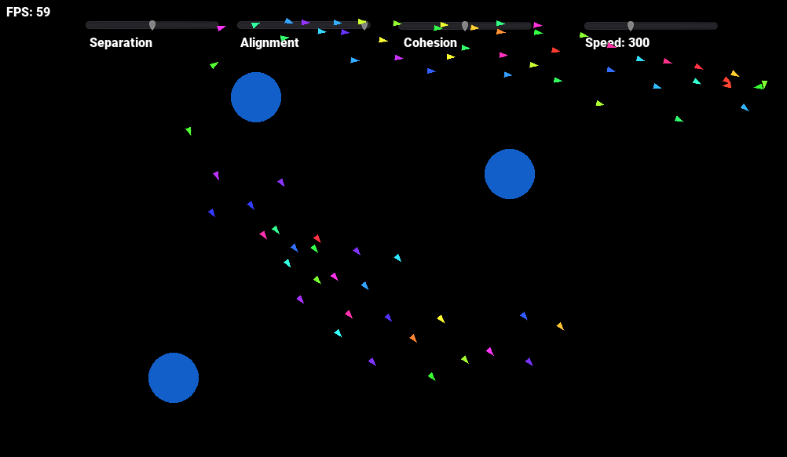

# Boids Algorithm

This is my take on the Boids Algorithm made in Godot Engine 3.2.3.

You can play it here: https://raphaklaus.itch.io/boids

References:

- https://www.red3d.com/cwr/boids/
- https://cs.stanford.edu/people/eroberts/courses/soco/projects/2008-09/modeling-natural-systems/boids.html
- https://gamedevelopment.tutsplus.com/series/understanding-steering-behaviors--gamedev-12732
- https://processing.org/examples/flocking.html
